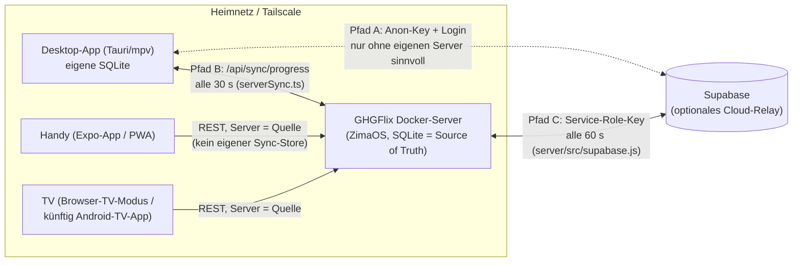

# GHGFlix — Sync-Architektur (Zielbild)

Entschieden am 16.07.2026 (Masterplan ARCH-01/ARCH-02/ARCH-12, Frage 3 → empfohlene Option).

## Grundsatz

**Der Docker-Server (ZimaOS) ist die „Source of Truth“ fürs Heimnetz.**
Supabase ist ein **optionales Cloud-Relay dahinter** — nicht jedes Gerät spricht
selbst mit Supabase.

## Wann greift welcher Pfad?

| Pfad | Wer ↔ wer | Key/Auth | Wann benutzen |
|---|---|---|---|
| **B** (`src/lib/serverSync.ts`) | Desktop ↔ Docker-Server | Server-Passwort/Token | **Standard** — funktioniert offline im LAN, alle 30 s |
| **C** (`server/src/supabase.js`) | Docker-Server ↔ Supabase | **Service-Role-Key** (`supabase_key`) | Optional: mehrere Standorte / Fortschritt unterwegs ohne VPN |
| **A** (`src/lib/supabase.ts`) | Desktop ↔ Supabase direkt | **Anon-Key** + E-Mail-Login | Nur für Nutzer **ohne** eigenen Server (reiner Cloud-Modus) |

Mobile- und TV-Clients sprechen **ausschließlich mit dem Docker-Server**
(ARCH-12) — sie haben keinen eigenen Sync-Mechanismus und keinen Supabase-Key.

## Feste Konventionen (ARCH-05)

- **Sync-Schlüssel** über alle Pfade: `(profile_id, media_type, tmdb_id, season, episode)` —
  `season/episode = -1` bei Filmen. Dupliziert in `src/lib/supabase.ts`,
  `server/src/supabase.js`, `server/src/index.js` und `supabase/schema.sql`;
  bei Schema-Änderungen **alle vier** Stellen anpassen.
- **Konfliktauflösung:** Last-Write-Wins über `updated_at` (Client-Uhrzeit, ms).
- **Server-Identität:** stabile `server_id` (UUID, Setting) aus `/api/ping` →
  Sync-Cursor der Clients hängen an der ID, nicht an der URL (S-017/ARCH-16).

## Bewusst NICHT umgesetzt (Backlog, mit Begründung)

- **ARCH-03/04** (gemeinsame Sync-Bibliothek, einheitliches Feldformat):
  lohnt erst, wenn die native TV-App als vierter Client dazukommt.
- **ARCH-17/SRV-023** (WebSocket-Push statt Polling): Polling (30/60 s) reicht
  für Fortschritts-Sync; Push spart erst bei vielen Geräten spürbar Akku.
- **S-009** (Supabase Realtime): nur sinnvoll im reinen Cloud-Modus (Pfad A).
- **SRV-026** (GraphQL/tRPC): Overkill für dieses Projekt.
